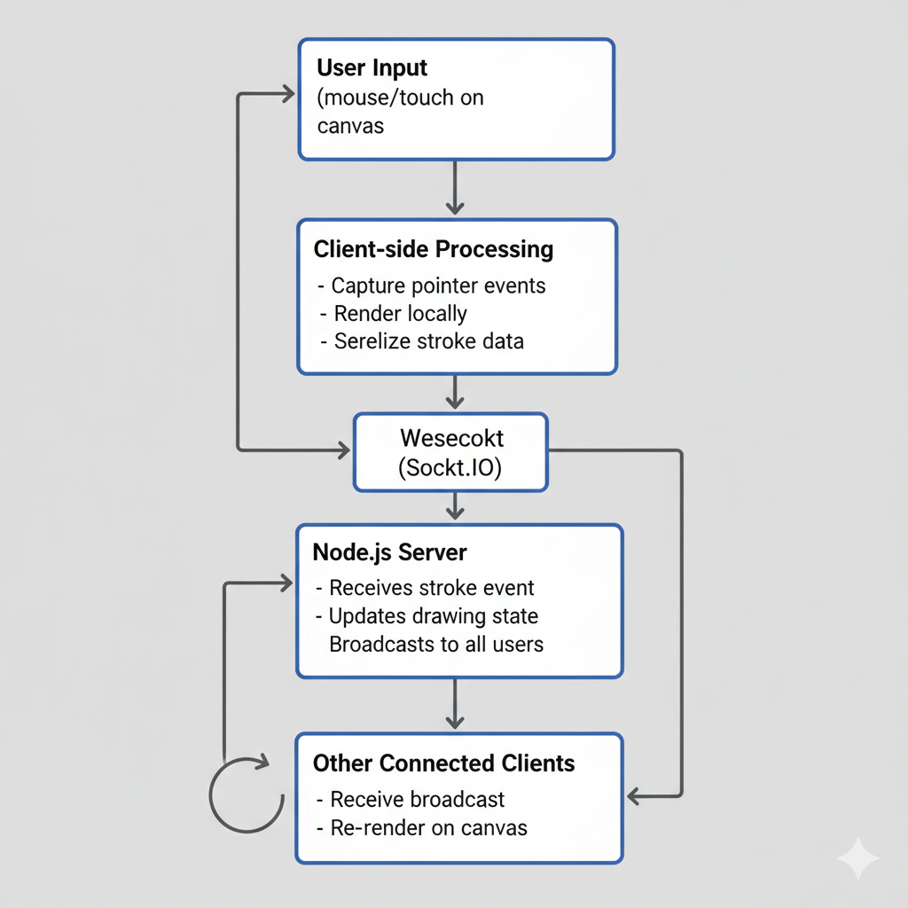

---

# ARCHITECTURE

## Overview
This application is a client-server, real-time collaborative drawing app. The server holds authoritative state (operation log) while clients render the canvas and optimistically show changes.

## Data Flow Diagram (conceptual)
User input (pointer events) -> Client sampling -> Buffer -> send `startStroke` -> server creates op -> client batches `strokePoints` -> server appends and broadcasts -> other clients receive `strokePoints` and draw incrementally -> `finishStroke` completes op.

## WebSocket Protocol
- `joinRoom` -> client sends to join a room
- `initState` -> server sends initial op list + users
- `startStroke` -> create operation on server
- `opCreated` -> server returns opId
- `strokePoints` -> batched points for opId
- `finishStroke` -> finalize op
- `undo`/`redo` -> server modifies op log and broadcasts
- `clear` -> server clears op log and broadcasts
- `cursorMove` -> broadcast cursor positions

## Undo/Redo Strategy
- Centralized op log on server (`DrawingState`).
- Undo pops last stroke op (global undo). Redo pushes from an `undoStack`.
- Guarantees deterministic ordering and uniform view across clients.
- Trade-offs: allows one user to undo another user’s stroke. Alternatives include per-user undo stacks and CRDT-based causal history which significantly increases complexity.

## Performance Decisions
- **Batching points**: reduce message count; batches every ~40ms.
- **Optimistic rendering**: client shows strokes locally immediately to reduce perceived latency.
- **Smoothing**: quadratic curves between points for natural lines.
- **DPR-aware canvas**: scale for high DPI displays.
- **Future optimizations**:
  - Offscreen per-op rendering cache
  - Snapshotting: send a PNG snapshot to new clients for fast join
  - Use binary messages (e.g., ArrayBuffers) to reduce payload size for high-frequency updates.

## Conflict Resolution
- Last-writer-wins in Z-order: operations are ordered by creation time on the server; later ops draw on top.
- Eraser implemented via `globalCompositeOperation = 'destination-out'` so it removes pixels.
- For stronger merging semantics, use smaller op granularity and causal ordering, or adopt CRDTs.

## Room Management
- Simple in-memory RoomManager with assigned user colors, user list, and per-room DrawingState.
- For production: back this by Redis or a persistent store, and replicate events across nodes.

